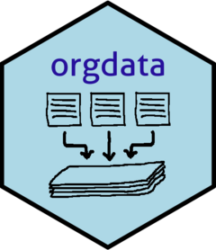

---
output:
  md_document:
    variant: gfm
html_preview: false
---

<!-- README.md is generated from README.Rmd. Please edit that file -->

```{r, include = FALSE}
knitr::opts_chunk$set(
  collapse = TRUE,
  comment = "#>",
  fig.path = "man/figures/README-",
  out.width = "100%"
)
```

# orgdata 


```{r echo=FALSE, results="hide", message=FALSE}
library("badger")
```


```{r, echo = FALSE, results='asis'}
cat(
  badge_github_actions(),
  badge_codecov("helseprofil/orgdata"),
  badge_lifecycle("maturing", "blue"),
  badge_github_version("helseprofil/orgdata", "blue")
)
```

Cleaning, restructuring and aggregating **OR**i**G**inal **DATA** into a
preferred dataset.

## Installation

To install then run this code

```r
if(!requireNamespace("remotes")) install.packages("remotes")
remotes::install_github("helseprofil/orgdata")
```

or use a user startup file *sepaafil.R* by cloning it from `user` branch

```sh
git clone -b user https://github.com/helseprofil/orgdata
```

To install development version from `orgdata`, use:

```r
library(orgdata)
update_orgdata(ref = "dev")
```

## Usage 

To implement the specifications per file group as being registered in 
the database use `make_file()` function. Parallel processing can be used if needed.

```r
library(orgdata)
# All files under BEFOLKNING group
dt <- make_file("BEFOLKNING")
dt <- make_file("BEFOLKNING", parallel = TRUE)

# For selected files with KOBLID
dt <- make_file("BEFOLKNING", koblid = 48)
dt <- make_file("BEFOLKNING", koblid = c(48, 72))
```

Use function `make_filegroups()` to process multiple file groups at once.

## Resources

- [Get started](https://helseprofil.github.io/orgdata/articles/get-started.html)
- [Functions overview](https://helseprofil.github.io/orgdata/reference/index.html)
- [Presentation slides](https://ybkamaleri.github.io/slides/2021-08-24-orgdata/#1)
- [Conventions](https://github.com/helseprofil/orgdata/blob/main/dev/standard.org)
- [Video guide](https://youtu.be/PhEQq4iWJCY)
