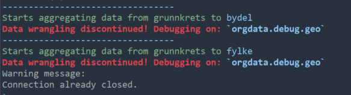

```{r, include = FALSE}
knitr::opts_chunk$set(
  collapse = TRUE,
  comment = "#>"
)
```

Debugging can be done via specification in `options()`. To check all the
*options* available for `orgdata` use `orgdata:::opt.orgdata`. Debugging options include:

 - `orgdata.debug`
 - `orgdata.debug.nrow`
 - `orgdata.debug.row`
 - `orgdata.debug.aggregate`
 - `orgdata.debug.geo`

Warning will be given when debugging is active.



## orgdata.debug

This is used to display the process flow when running any functions in `orgdata`. It is
useful to know which process creates problems during troubleshoot. To activate:

```{r debug, eval = FALSE}
options(orgdata.debug = TRUE)
```

## orgdata.debug.nrow

To make testing faster for a very big file, you can load only some rows by
activating this options. For instance, to load only the first 50 rows use:

```{r row, eval = FALSE}
options(orgdata.debug.nrow = 50)
```

## orgdata.debug.row 

To select only specific row(s) for further processing. This is very useful
especially when activating [`orgdata.debug.geo`](#geo) option. To select only
rows 20 to 50:

```{r eval = FALSE}
options(orgdata.debug.row = 20:50)
```

## orgdata.debug.aggregate

To check how the geographical codes in the original data will or could be
aggregated to. For instance the original data that consist of enumeration area
codes can be aggregated to municipality or county. Activating this options will
add the columns of origin geographical codes and the codes to aggregate into
municipality, county, city etc to the output data. 

The difference between this options and `aggreagate` argument in `make_file()`
is that the argument `aggregate = FALSE` will cease aggregating after recoding
geographical codes in the original data. To use:

```{r aggregate, eval = FALSE}
options(orgdata.debug.aggregate = TRUE)
```

## orgdata.debug.geo {#geo}

This option is used to check the code to use for recoding geographical codes
from the original data to the current geographical codes. A new columns called
`oriGEO` will be added consisting the geographical codes of the original data as
in the [example](#expl).

Column `GEO` is the code to recode `oriGEO`. If the value is
`NA` in column `GEO` then no recode will be done for the respective code. The
reason is either the codes is still valid for the current year or no recode code
available/valid and will be deleted. A warning will be given.

```{r geo, eval = FALSE}
options(orgdata.debug.geo = TRUE)
```

## reset

When activating any options for `orgdata`, it will be kept active until you
actively deactivate it or restart a new R session. You can deactivate it with:

```{r reset, eval = FALSE}
reset_options()
```

## Example output {#expl}

Here is an example of output after activating `orgdata.debug.geo`

```{}
          oriGEO      GEO  AAR KJONN UTDANN TAB1 TAB2 TAB3 TAB4   ANDRE   ANNEN
     1:  1010102 30010102 2019     0     01    2    8    1    1       1       2
     2:  1010102 30010102 2019     0     01    2    5    1    1       1       3
     3:  1010102 30010102 2019     0     01    1    8    1    1       1       3
     4:  1010102 30010102 2019     0     01    3    8    1    1       3       3
     5:  1010102 30010102 2019     0     02    3    8    2    2      20      20
    ---                                                                        
326790: 50610108       NA 2019     2     02    2    5    1    2      20      20
326791: 50610108       NA 2019     2     02    3    5    1    2      20      20
326792: 50610108       NA 2019     2     02    4    8    1    1      20      20
326793: 50610110       NA 2019     0     03    4    8    1    1      20      20
326794: 50610110       NA 2019     1     03    4    8    1    1      20      20
 
```
